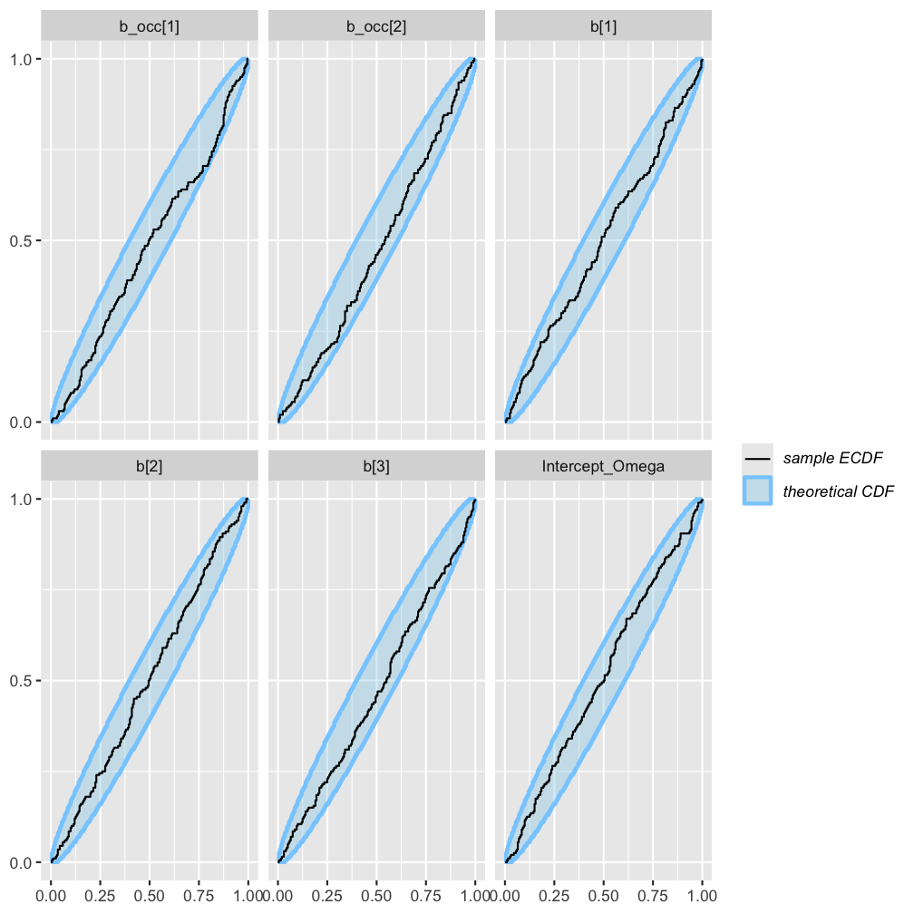
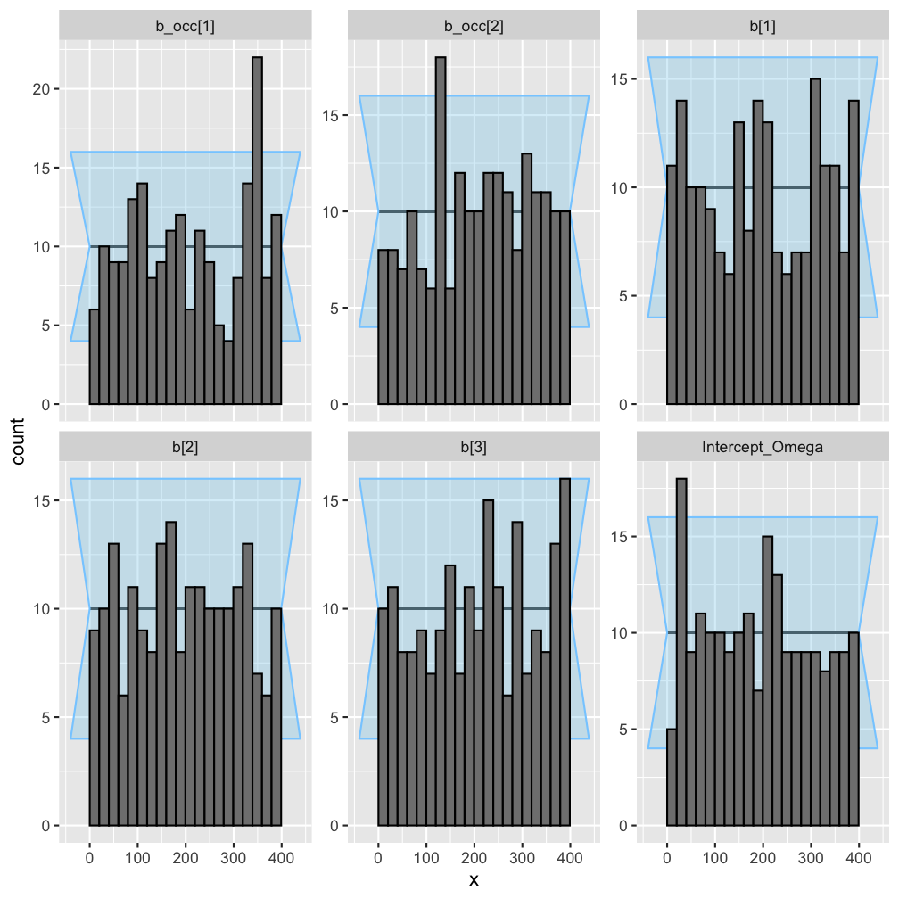
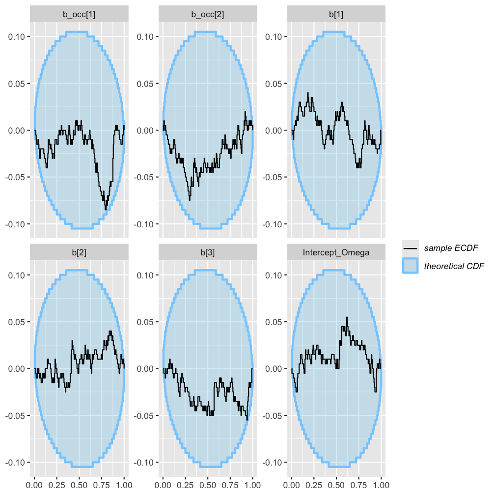

### Rmd parameters

```
##                   Parameter value
## 1          n_sims_augmented   200
## 2         n_sites_augmented    50
## 3 n_pseudospecies_augmented    50
```


``` r
library(flocker)
library(brms)
library(SBC)
set.seed(1)
```

## Overview

This document is one of a series of simulation-based calibration exercieses for
models available in R package `flocker`. Here, our goal is to validate `flocker`'s 
data formatting, decoding, and likelihood implementations, and not `brms`'s 
construction of the linear predictors.

The encoding of the data for a `flocker` model tends to be more complex in the 
presence of missing observations, and so we include missingness in the data 
simulation wherever possible (some visits missing in all models, some time-steps
missing in multiseason models). 

In all models, we include one unit covariate that affects detection and 
occupancy, colonization, extinction and/or autologistic terms as applicable, 
and one event covariate that affects detection only (for all models except the
rep-constant).


## Data-augmented

``` r
# make the stancode
model_name <- paste0(tempdir(), "/sbc_augmented_model.stan")

omega <- boot::inv.logit(rnorm(1, 0, .1))
available <- rbinom(1, params$n_pseudospecies_augmented, omega)
unavailable <- params$n_pseudospecies_augmented - available

coef_means <- rnorm(5)        # population-level effects (std_normal)
sigma <- abs(rnorm(5))        # half-normal(0,1) for sd parameters

coefs_df <- data.frame(
  det_intercept  = rnorm(available, coef_means[1], sigma[1]),
  det_slope_unit = rnorm(available, coef_means[2], sigma[2]),
  det_slope_visit= rnorm(available, coef_means[3], sigma[3]),
  occ_intercept  = rnorm(available, coef_means[4], sigma[4]),
  occ_slope_unit = rnorm(available, coef_means[5], sigma[5])
)

fd <- simulate_flocker_data(
  n_pt = params$n_sites_augmented, n_sp = available,
  params = list(coefs = coefs_df),
  seed = NULL,
  rep_constant = FALSE,
  ragged_rep = TRUE
)

obs_aug <- fd$obs[seq_len(params$n_sites_augmented), ]

for(i in 2:available){
  obs_aug <- abind::abind(
    obs_aug, 
    fd$obs[((i - 1) * params$n_sites_augmented) + seq_len(params$n_sites_augmented), ], 
    along = 3
    )
}

event_covs_aug <- list(ec1 = fd$event_covs$ec1[seq_len(params$n_sites_augmented), ])
unit_covs_aug <- data.frame(uc1 = fd$unit_covs[seq_len(params$n_sites_augmented), "uc1"])

flocker_data = make_flocker_data(
  obs_aug, unit_covs_aug, event_covs_aug,
  type = "augmented", n_aug = unavailable,
  quiet = TRUE)
  
scode <- flocker_stancode(
    f_occ = ~ 0 + Intercept + uc1 + (1 + uc1 || ff_species),
    f_det = ~ 0 + Intercept + uc1 + ec1 + (1 + uc1 + ec1 || ff_species),
    flocker_data = flocker_data,
    prior = 
      brms::set_prior("std_normal()") + 
      brms::set_prior("std_normal()", class = "sd") +
      brms::set_prior("std_normal()", dpar = "occ") +
      brms::set_prior("std_normal()", class = "sd", dpar = "occ") +
      brms::set_prior("normal(0, 0.1)", class = "Intercept", dpar = "Omega"),
    backend = "cmdstanr",
    augmented = TRUE
  )
writeLines(scode, model_name)

aug_generator <- function(N){  
  omega <- boot::inv.logit(rnorm(1, 0, .1))
  available <- rbinom(1, params$n_pseudospecies_augmented, omega)
  unavailable <- params$n_pseudospecies_augmented - available

  coef_means <- rnorm(5)
  sigma <- abs(rnorm(5))

  coefs_df <- data.frame(
    det_intercept   = rnorm(available, coef_means[1], sigma[1]),
    det_slope_unit  = rnorm(available, coef_means[2], sigma[2]),
    det_slope_visit = rnorm(available, coef_means[3], sigma[3]),
    occ_intercept   = rnorm(available, coef_means[4], sigma[4]),
    occ_slope_unit  = rnorm(available, coef_means[5], sigma[5])
  )

  fd <- simulate_flocker_data(
    n_pt = params$n_sites_augmented, n_sp = available,
    params = list(coefs = coefs_df),
    seed = NULL,
    rep_constant = FALSE,
    ragged_rep = TRUE
  )

  obs_aug <- fd$obs[seq_len(params$n_sites_augmented), ]
  for(i in 2:available){
    obs_aug <- abind::abind(
      obs_aug, 
      fd$obs[((i - 1) * params$n_sites_augmented) + seq_len(params$n_sites_augmented), ], 
      along = 3
    )
  }

  event_covs_aug <- list(ec1 = fd$event_covs$ec1[seq_len(params$n_sites_augmented), ])
  unit_covs_aug <- data.frame(uc1 = fd$unit_covs[seq_len(params$n_sites_augmented), "uc1"])

  flocker_data <- make_flocker_data(
    obs_aug, unit_covs_aug, event_covs_aug,
    type = "augmented", n_aug = unavailable,
    quiet = TRUE
  )

  list(
    variables = list(
      `b[1]` = coef_means[1],
      `b[2]` = coef_means[2],
      `b[3]` = coef_means[3],
      `b_occ[1]` = coef_means[4],
      `b_occ[2]` = coef_means[5],
      `Intercept_Omega` = boot::logit(omega)
      # Optional but recommended for “fuller” SBC on the augmented model:
      # `sd_1[1]` = sigma[1], ...
    ),
    generated = flocker_standata(
      f_occ = ~ 0 + Intercept + uc1 + (1 + uc1 || ff_species),
      f_det = ~ 0 + Intercept + uc1 + ec1 + (1 + uc1 + ec1 || ff_species),
      flocker_data = flocker_data,
      augmented = TRUE
    )
  )
}

aug_gen <- SBC_generator_function(
  aug_generator, 
  N = params$n_sites_augmented
  )
aug_dataset <- suppressMessages(
  generate_datasets(aug_gen, params$n_sims_augmented)
)
  
aug_backend <- 
  SBC_backend_cmdstan_sample(
    cmdstanr::cmdstan_model(
      paste0(tempdir(), "/sbc_augmented_model.stan")
      )
    )

aug_results <- compute_SBC(aug_dataset, aug_backend)
```

```
##  - 4 (2%) fits had divergences. Maximum number of divergences was 6.
```

```
##  - 10 (5%) fits had steps rejected. Maximum number of steps rejected was 1.
```

```
##  - 1 (0%) fits had maximum Rhat > 1.01. Maximum Rhat was 1.012.
```

```
## Not all diagnostics are OK.
## You can learn more by inspecting $default_diagnostics, $backend_diagnostics 
## and/or investigating $outputs/$messages/$warnings for detailed output from the backend.
```

``` r
plot_ecdf(aug_results)
```

<div class="figure">

<p class="caption">plot of chunk data-augmented</p>
</div>

``` r
plot_rank_hist(aug_results)
```

<div class="figure">

<p class="caption">plot of chunk data-augmented</p>
</div>

``` r
plot_ecdf_diff(aug_results)
```

<div class="figure">

<p class="caption">plot of chunk data-augmented</p>
</div>
