### Rmd parameters

```
##   Parameter value
## 1    n_sims  1000
## 2   n_sites   200
```


``` r
library(flocker)
library(brms)
library(SBC)
set.seed(1)
```

## Overview

This document is one of a series of simulation-based calibration exercieses for
models available in R package `flocker`. Here, our goal is to validate `flocker`'s 
data formatting, decoding, and likelihood implementations, and not `brms`'s 
construction of the linear predictors.

The encoding of the data for a `flocker` model tends to be more complex in the 
presence of missing observations, and so we include missingness in the data 
simulation wherever possible (some visits missing in all models, some time-steps
missing in multiseason models). 

In all models, we include one unit covariate that affects detection and 
occupancy, colonization, extinction and/or autologistic terms as applicable, 
and one event covariate that affects detection only (for all models except the
rep-constant).


## Multi-season
`flocker` fits multi-season models that parameterize the dynamics using colonization/extinction or autologistic specifications, and that parameterize
the initial occupancy state using explicit and equilibrium parameterizations, 
for a total of four classes of multi-season model. We validate each class.

### Colonization-extinction, explicit initial occupancy

``` r
# make the stancode
model_name <- paste0(tempdir(), "/sbc_colex_ex_model.stan")
fd <- simulate_flocker_data(
  n_pt = params$n_sites, n_sp = 1, n_season = 4,
  params = list(
    coefs = data.frame(
      det_intercept = rnorm(1),
      det_slope_unit = rnorm(1),
      det_slope_visit = rnorm(1),
      occ_intercept = rnorm(1),
      occ_slope_unit = rnorm(1),
      col_intercept = rnorm(1),
      col_slope_unit = rnorm(1),
      ex_intercept = rnorm(1),
      ex_slope_unit = rnorm(1)
    )
  ),
  seed = NULL,
  rep_constant = FALSE,
  multiseason = "colex",
  multi_init = "explicit",
  ragged_rep = TRUE
)
flocker_data = make_flocker_data(
  fd$obs, fd$unit_covs, fd$event_covs,
  type = "multi", quiet = TRUE)
  
scode <- flocker_stancode(
    f_occ = ~ 0 + Intercept + uc1,
    f_col = ~ 0 + Intercept + uc1,
    f_ex = ~ 0 + Intercept + uc1,
    f_det = ~ 0 + Intercept + uc1 + ec1,
    flocker_data = flocker_data,
    prior = 
      brms::set_prior("std_normal()") + 
      brms::set_prior("std_normal()", dpar = "occ") +
      brms::set_prior("std_normal()", dpar = "colo") +
      brms::set_prior("std_normal()", dpar = "ex"),
    multiseason = "colex",
    multi_init = "explicit",
    backend = "cmdstanr"
  )
writeLines(scode, model_name)

colex_ex_generator <- function(N){  
  fd <- simulate_flocker_data(
    n_pt = N, n_sp = 1, n_season = 4,
    params = list(
      coefs = data.frame(
        det_intercept = rnorm(1),
        det_slope_unit = rnorm(1),
        det_slope_visit = rnorm(1),
        occ_intercept = rnorm(1),
        occ_slope_unit = rnorm(1),
        col_intercept = rnorm(1),
        col_slope_unit = rnorm(1),
        ex_intercept = rnorm(1),
        ex_slope_unit = rnorm(1)
        )
    ),
    seed = NULL,
    rep_constant = FALSE,
    multiseason = "colex",
    multi_init = "explicit",
    ragged_rep = TRUE
  )
  
  flocker_data = make_flocker_data(
    fd$obs, fd$unit_covs, fd$event_covs,
    type = "multi", quiet = TRUE)
  
  # format for return
  list(
    variables = list(
      `b[1]` = fd$params$coefs$det_intercept,
      `b[2]` = fd$params$coefs$det_slope_unit,
      `b[3]` = fd$params$coefs$det_slope_visit,
      `b_occ[1]` = fd$params$coefs$occ_intercept,
      `b_occ[2]` = fd$params$coefs$occ_slope_unit,
      `b_colo[1]` = fd$params$coefs$col_intercept,
      `b_colo[2]` = fd$params$coefs$col_slope_unit,
      `b_ex[1]` = fd$params$coefs$ex_intercept,
      `b_ex[2]` = fd$params$coefs$ex_slope_unit
    ),
    generated = flocker_standata(
      f_occ = ~ 0 + Intercept + uc1,
      f_col = ~ 0 + Intercept + uc1,
      f_ex = ~ 0 + Intercept + uc1,
      f_det = ~ 0 + Intercept + uc1 + ec1,
      flocker_data = flocker_data,
      multiseason = "colex",
      multi_init = "explicit"
    )
  )
}

colex_ex_gen <- SBC_generator_function(
  colex_ex_generator, 
  N = params$n_sites
  )
colex_ex_dataset <- suppressMessages(
  generate_datasets(colex_ex_gen, params$n_sims)
)
  
colex_ex_backend <- 
  SBC_backend_cmdstan_sample(
    cmdstanr::cmdstan_model(
      paste0(tempdir(), "/sbc_colex_ex_model.stan")
      )
    )

colex_ex_results <- compute_SBC(colex_ex_dataset, colex_ex_backend)

plot_ecdf(colex_ex_results)
```

<div class="figure">
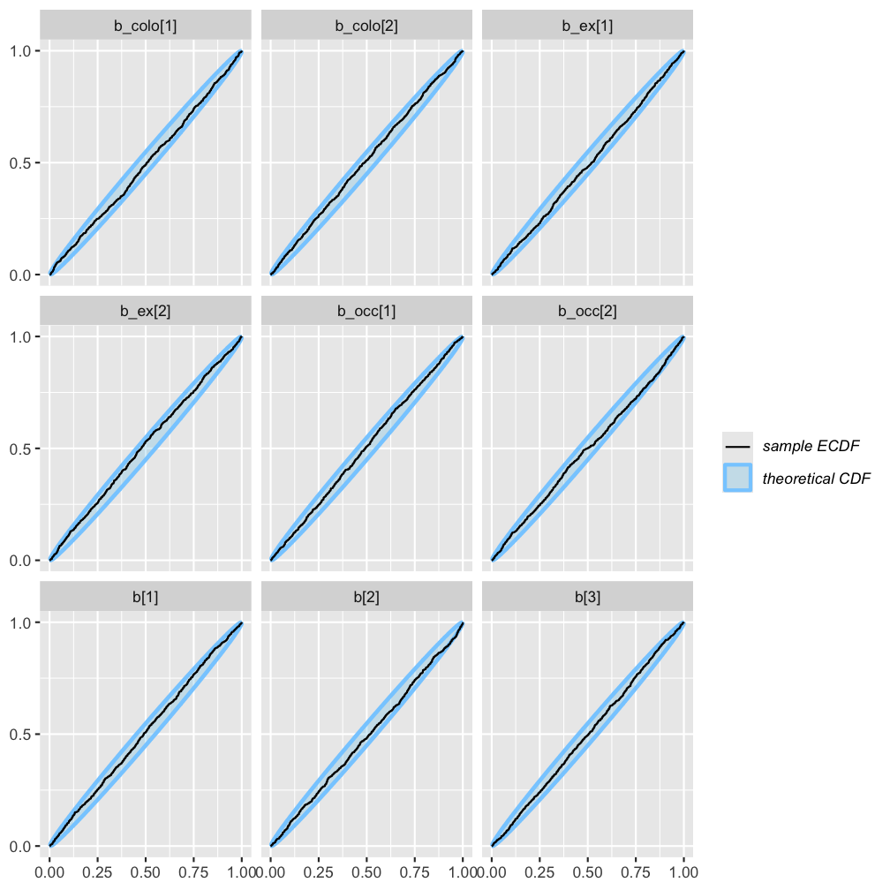
<p class="caption">plot of chunk multi-colex-ex</p>
</div>

``` r
plot_rank_hist(colex_ex_results)
```

<div class="figure">
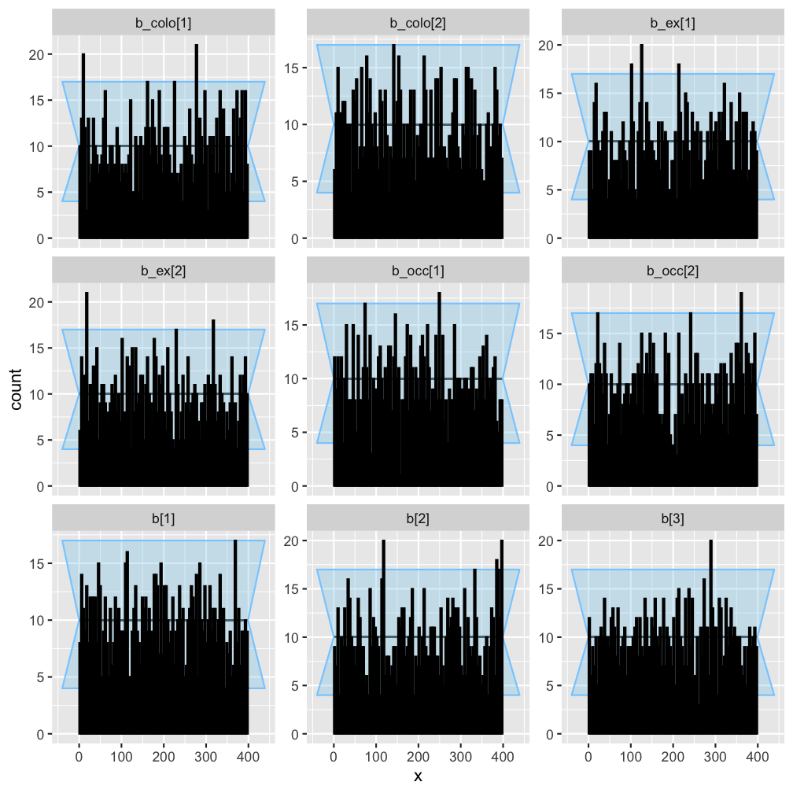
<p class="caption">plot of chunk multi-colex-ex</p>
</div>

``` r
plot_ecdf_diff(colex_ex_results)
```

<div class="figure">
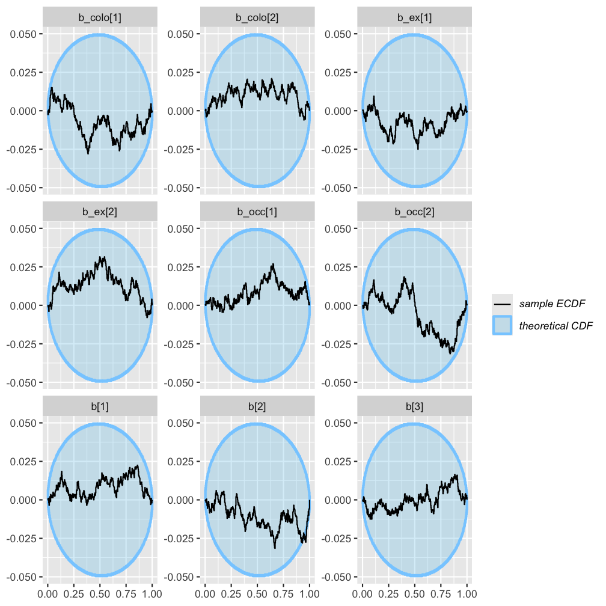
<p class="caption">plot of chunk multi-colex-ex</p>
</div>

### Colonization-extinction, equilibrium initial occupancy

``` r
# make the stancode
model_name <- paste0(tempdir(), "/sbc_colex_eq_model.stan")
fd <- simulate_flocker_data(
  n_pt = params$n_sites, n_sp = 1, n_season = 4,
    params = list(
      coefs = data.frame(
        det_intercept = rnorm(1),
        det_slope_unit = rnorm(1),
        det_slope_visit = rnorm(1),
        col_intercept = rnorm(1),
        col_slope_unit = rnorm(1),
        ex_intercept = rnorm(1),
        ex_slope_unit = rnorm(1)
        )
    ),
  seed = NULL,
  rep_constant = FALSE,
  multiseason = "colex",
  multi_init = "equilibrium",
  ragged_rep = TRUE
)
flocker_data = make_flocker_data(
  fd$obs, fd$unit_covs, fd$event_covs,
  type = "multi", quiet = TRUE)
  
scode <- flocker_stancode(
  f_col = ~ 0 + Intercept + uc1,
  f_ex = ~ 0 + Intercept + uc1,
  f_det = ~ 0 + Intercept + uc1 + ec1,
  flocker_data = flocker_data,
  prior = 
    brms::set_prior("std_normal()") + 
    brms::set_prior("std_normal()", dpar = "colo") +
    brms::set_prior("std_normal()", dpar = "ex"),
  multiseason = "colex",
  multi_init = "equilibrium",
  backend = "cmdstanr"
  )
writeLines(scode, model_name)

colex_eq_generator <- function(N){  
  fd <- simulate_flocker_data(
    n_pt = N, n_sp = 1, n_season = 4,
    params = list(
      coefs = data.frame(
        det_intercept = rnorm(1),
        det_slope_unit = rnorm(1),
        det_slope_visit = rnorm(1),
        col_intercept = rnorm(1),
        col_slope_unit = rnorm(1),
        ex_intercept = rnorm(1),
        ex_slope_unit = rnorm(1)
        )
    ),
    seed = NULL,
    rep_constant = FALSE,
    multiseason = "colex",
    multi_init = "equilibrium",
    ragged_rep = TRUE
  )
  
  flocker_data = make_flocker_data(
    fd$obs, fd$unit_covs, fd$event_covs,
    type = "multi", quiet = TRUE)
  
  # format for return
  list(
    variables = list(
      `b[1]` = fd$params$coefs$det_intercept,
      `b[2]` = fd$params$coefs$det_slope_unit,
      `b[3]` = fd$params$coefs$det_slope_visit,
      `b_colo[1]` = fd$params$coefs$col_intercept,
      `b_colo[2]` = fd$params$coefs$col_slope_unit,
      `b_ex[1]` = fd$params$coefs$ex_intercept,
      `b_ex[2]` = fd$params$coefs$ex_slope_unit
    ),
    generated = flocker_standata(
      f_col = ~ 0 + Intercept + uc1,
      f_ex = ~ 0 + Intercept + uc1,
      f_det = ~ 0 + Intercept + uc1 + ec1,
      flocker_data = flocker_data,
      multiseason = "colex",
      multi_init = "equilibrium"
    )
  )
}

colex_eq_gen <- SBC_generator_function(
  colex_eq_generator, 
  N = params$n_sites
  )
colex_eq_dataset <- suppressMessages(
  generate_datasets(colex_eq_gen, params$n_sims)
)
  
colex_eq_backend <- 
  SBC_backend_cmdstan_sample(
    cmdstanr::cmdstan_model(
      paste0(tempdir(), "/sbc_colex_eq_model.stan")
      )
    )

colex_eq_results <- compute_SBC(colex_eq_dataset, colex_eq_backend)
```

```
##  - 843 (84%) fits had steps rejected. Maximum number of steps rejected was 4.
```

```
## Not all diagnostics are OK.
## You can learn more by inspecting $default_diagnostics, $backend_diagnostics 
## and/or investigating $outputs/$messages/$warnings for detailed output from the backend.
```

``` r
plot_ecdf(colex_eq_results)
```

<div class="figure">
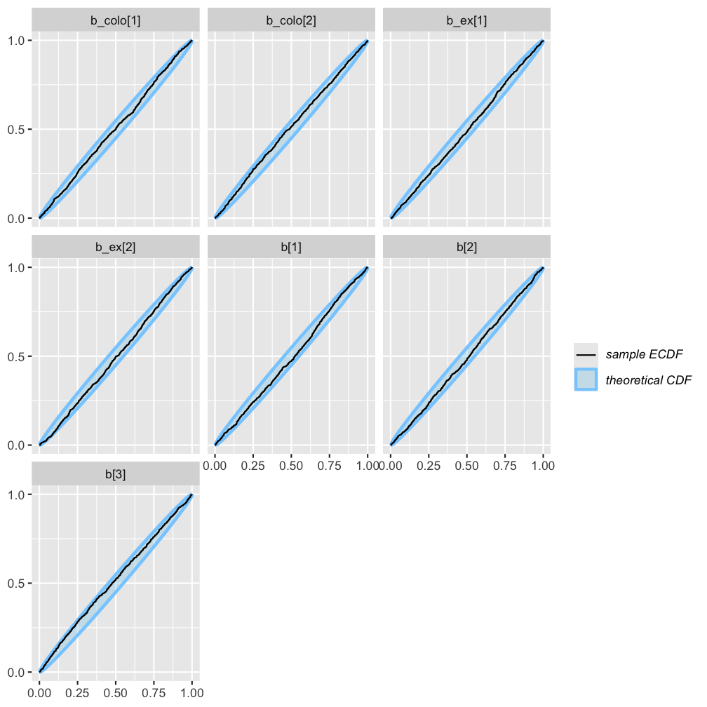
<p class="caption">plot of chunk multi-colex-eq</p>
</div>

``` r
plot_rank_hist(colex_eq_results)
```

<div class="figure">
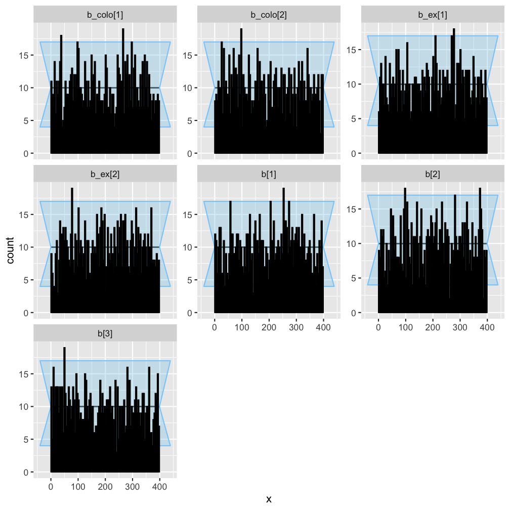
<p class="caption">plot of chunk multi-colex-eq</p>
</div>

``` r
plot_ecdf_diff(colex_eq_results)
```

<div class="figure">
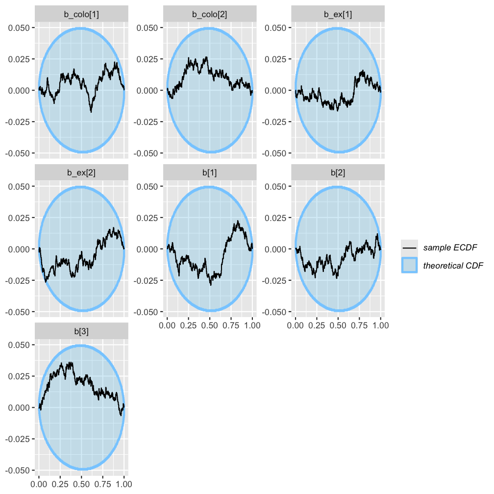
<p class="caption">plot of chunk multi-colex-eq</p>
</div>

### Autologistic, explicit initial occupancy

``` r
# make the stancode
model_name <- paste0(tempdir(), "/sbc_auto_ex_model.stan")
fd <- simulate_flocker_data(
  n_pt = params$n_sites, n_sp = 1, n_season = 4,
    params = list(
      coefs = data.frame(
        det_intercept = rnorm(1),
        det_slope_unit = rnorm(1),
        det_slope_visit = rnorm(1),
        occ_intercept = rnorm(1),
        occ_slope_unit = rnorm(1),
        col_intercept = rnorm(1),
        col_slope_unit = rnorm(1),
        auto_intercept = rnorm(1),
        auto_slope_unit = rnorm(1)
        )
    ),
  seed = NULL,
  rep_constant = FALSE,
  multiseason = "autologistic",
  multi_init = "explicit",
  ragged_rep = TRUE
)
flocker_data = make_flocker_data(
  fd$obs, fd$unit_covs, fd$event_covs,
  type = "multi", quiet = TRUE)
  
scode <- flocker_stancode(
    f_occ = ~ 0 + Intercept + uc1,
    f_col = ~ 0 + Intercept + uc1,
    f_auto = ~ 0 + Intercept + uc1,
    f_det = ~ 0 + Intercept + uc1 + ec1,
    flocker_data = flocker_data,
    prior = 
      brms::set_prior("std_normal()") + 
      brms::set_prior("std_normal()", dpar = "occ") +
      brms::set_prior("std_normal()", dpar = "colo") +
      brms::set_prior("std_normal()", dpar = "autologistic"),
    multiseason = "autologistic",
    multi_init = "explicit",
    backend = "cmdstanr"
  )
writeLines(scode, model_name)

auto_ex_generator <- function(N){  
  fd <- simulate_flocker_data(
    n_pt = N, n_sp = 1, n_season = 4,
    params = list(
      coefs = data.frame(
        det_intercept = rnorm(1),
        det_slope_unit = rnorm(1),
        det_slope_visit = rnorm(1),
        occ_intercept = rnorm(1),
        occ_slope_unit = rnorm(1),
        col_intercept = rnorm(1),
        col_slope_unit = rnorm(1),
        auto_intercept = rnorm(1),
        auto_slope_unit = rnorm(1)
        )
    ),
    seed = NULL,
    rep_constant = FALSE,
    multiseason = "autologistic",
    multi_init = "explicit",
    ragged_rep = TRUE
  )
  
  flocker_data = make_flocker_data(
    fd$obs, fd$unit_covs, fd$event_covs,
    type = "multi", quiet = TRUE)
  
  # format for return
  list(
    variables = list(
      `b[1]` = fd$params$coefs$det_intercept,
      `b[2]` = fd$params$coefs$det_slope_unit,
      `b[3]` = fd$params$coefs$det_slope_visit,
      `b_occ[1]` = fd$params$coefs$occ_intercept,
      `b_occ[2]` = fd$params$coefs$occ_slope_unit,
      `b_colo[1]` = fd$params$coefs$col_intercept,
      `b_colo[2]` = fd$params$coefs$col_slope_unit,
      `b_autologistic[1]` = fd$params$coefs$auto_intercept,
      `b_autologistic[2]` = fd$params$coefs$auto_slope_unit
    ),
    generated = flocker_standata(
      f_occ = ~ 0 + Intercept + uc1,
      f_col = ~ 0 + Intercept + uc1,
      f_auto = ~ 0 + Intercept + uc1,
      f_det = ~ 0 + Intercept + uc1 + ec1,
      flocker_data = flocker_data,
      multiseason = "autologistic",
      multi_init = "explicit"
    )
  )
}

auto_ex_gen <- SBC_generator_function(
  auto_ex_generator, 
  N = params$n_sites
  )
auto_ex_dataset <- suppressMessages(
  generate_datasets(auto_ex_gen, params$n_sims)
)
  
auto_ex_backend <- 
  SBC_backend_cmdstan_sample(
    cmdstanr::cmdstan_model(
      paste0(tempdir(), "/sbc_auto_ex_model.stan")
      )
    )

auto_ex_results <- compute_SBC(auto_ex_dataset, auto_ex_backend)

plot_ecdf(auto_ex_results)
```

<div class="figure">
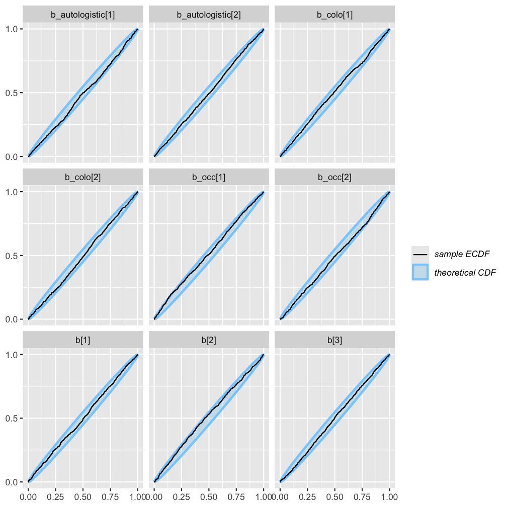
<p class="caption">plot of chunk multi-auto-ex</p>
</div>

``` r
plot_rank_hist(auto_ex_results)
```

<div class="figure">
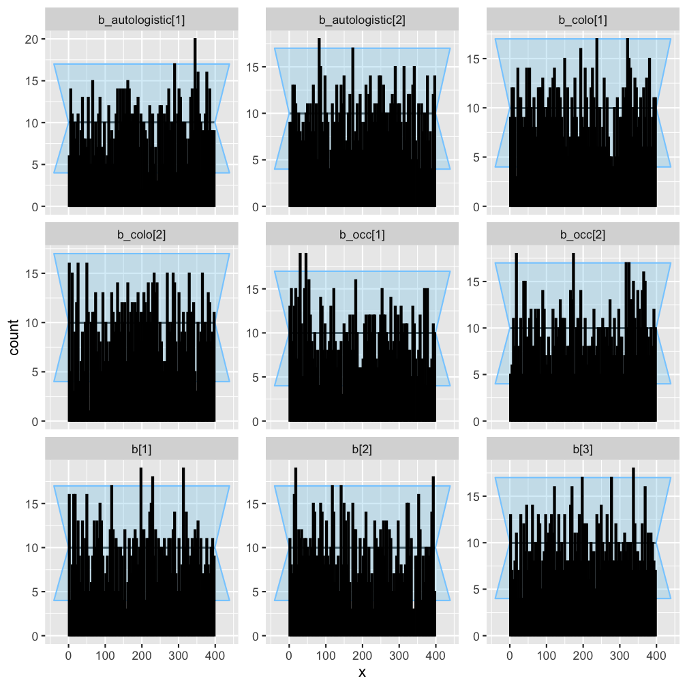
<p class="caption">plot of chunk multi-auto-ex</p>
</div>

``` r
plot_ecdf_diff(auto_ex_results)
```

<div class="figure">
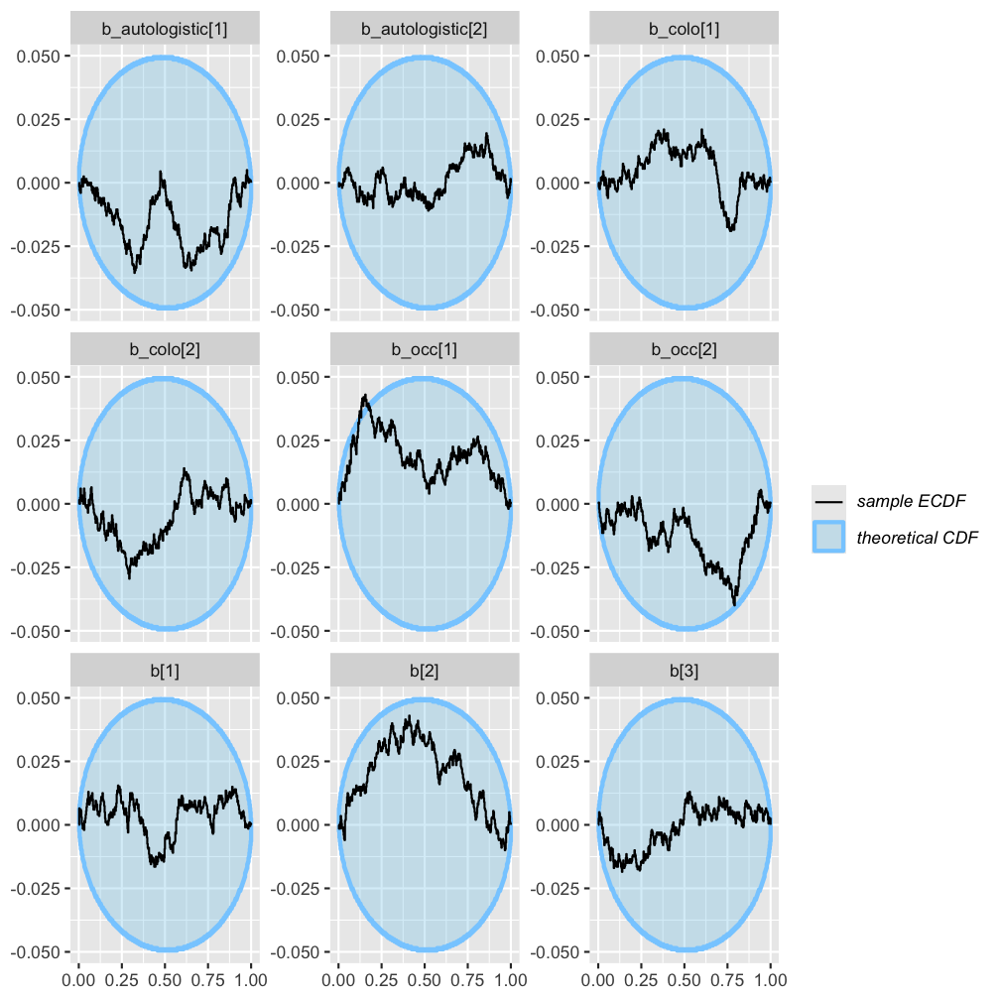
<p class="caption">plot of chunk multi-auto-ex</p>
</div>

### Autologistic, equilibrium initial occupancy

``` r
# make the stancode
model_name <- paste0(tempdir(), "/sbc_auto_eq_model.stan")
fd <- simulate_flocker_data(
  n_pt = params$n_sites, n_sp = 1, n_season = 4,
    params = list(
      coefs = data.frame(
        det_intercept = rnorm(1),
        det_slope_unit = rnorm(1),
        det_slope_visit = rnorm(1),
        col_intercept = rnorm(1),
        col_slope_unit = rnorm(1),
        auto_intercept = rnorm(1),
        auto_slope_unit = rnorm(1)
        )
    ),
  seed = NULL,
  rep_constant = FALSE,
  multiseason = "autologistic",
  multi_init = "equilibrium",
  ragged_rep = TRUE
)
flocker_data = make_flocker_data(
  fd$obs, fd$unit_covs, fd$event_covs,
  type = "multi", quiet = TRUE)
  
scode <- flocker_stancode(
    f_col = ~ 0 + Intercept + uc1,
    f_auto = ~ 0 + Intercept + uc1,
    f_det = ~ 0 + Intercept + uc1 + ec1,
    flocker_data = flocker_data,
    prior = 
      brms::set_prior("std_normal()") + 
      brms::set_prior("std_normal()", dpar = "colo") +
      brms::set_prior("std_normal()", dpar = "autologistic"),
    multiseason = "autologistic",
    multi_init = "equilibrium",
    backend = "cmdstanr"
  )
writeLines(scode, model_name)

auto_eq_generator <- function(N){  
  fd <- simulate_flocker_data(
    n_pt = N, n_sp = 1, n_season = 4,
    params = list(
      coefs = data.frame(
        det_intercept = rnorm(1),
        det_slope_unit = rnorm(1),
        det_slope_visit = rnorm(1),
        col_intercept = rnorm(1),
        col_slope_unit = rnorm(1),
        auto_intercept = rnorm(1),
        auto_slope_unit = rnorm(1)
        )
    ),
    seed = NULL,
    rep_constant = FALSE,
    multiseason = "autologistic",
    multi_init = "equilibrium",
    ragged_rep = TRUE
  )
  
  flocker_data = make_flocker_data(
    fd$obs, fd$unit_covs, fd$event_covs,
    type = "multi", quiet = TRUE)
  
  # format for return
  list(
    variables = list(
      `b[1]` = fd$params$coefs$det_intercept,
      `b[2]` = fd$params$coefs$det_slope_unit,
      `b[3]` = fd$params$coefs$det_slope_visit,
      `b_colo[1]` = fd$params$coefs$col_intercept,
      `b_colo[2]` = fd$params$coefs$col_slope_unit,
      `b_autologistic[1]` = fd$params$coefs$auto_intercept,
      `b_autologistic[2]` = fd$params$coefs$auto_slope_unit
    ),
    generated = flocker_standata(
      f_col = ~ 0 + Intercept + uc1,
      f_auto = ~ 0 + Intercept + uc1,
      f_det = ~ 0 + Intercept + uc1 + ec1,
      flocker_data = flocker_data,
      multiseason = "autologistic",
      multi_init = "equilibrium"
    )
  )
}

auto_eq_gen <- SBC_generator_function(
  auto_eq_generator, 
  N = params$n_sites
  )
auto_eq_dataset <- suppressMessages(
  generate_datasets(auto_eq_gen, params$n_sims)
)
  
auto_eq_backend <- 
  SBC_backend_cmdstan_sample(
    cmdstanr::cmdstan_model(
      paste0(tempdir(), "/sbc_auto_eq_model.stan")
      )
    )

auto_eq_results <- compute_SBC(auto_eq_dataset, auto_eq_backend)
```

```
##  - 346 (35%) fits had steps rejected. Maximum number of steps rejected was 3.
```

```
##  - 1 (0%) fits had tail ESS / maximum rank < 0.5. Minimum tail ESS / maximum rank was 0.45. This potentially skews the rank statistics.
##     If the fits look good otherwise, increasing `thin_ranks` (via recompute_SBC_statistics) 
##    or number of posterior draws (by refitting) might help.
```

```
## Not all diagnostics are OK.
## You can learn more by inspecting $default_diagnostics, $backend_diagnostics 
## and/or investigating $outputs/$messages/$warnings for detailed output from the backend.
```

``` r
plot_ecdf(auto_eq_results)
```

<div class="figure">

<p class="caption">plot of chunk multi-auto-eq</p>
</div>

``` r
plot_rank_hist(auto_eq_results)
```

<div class="figure">
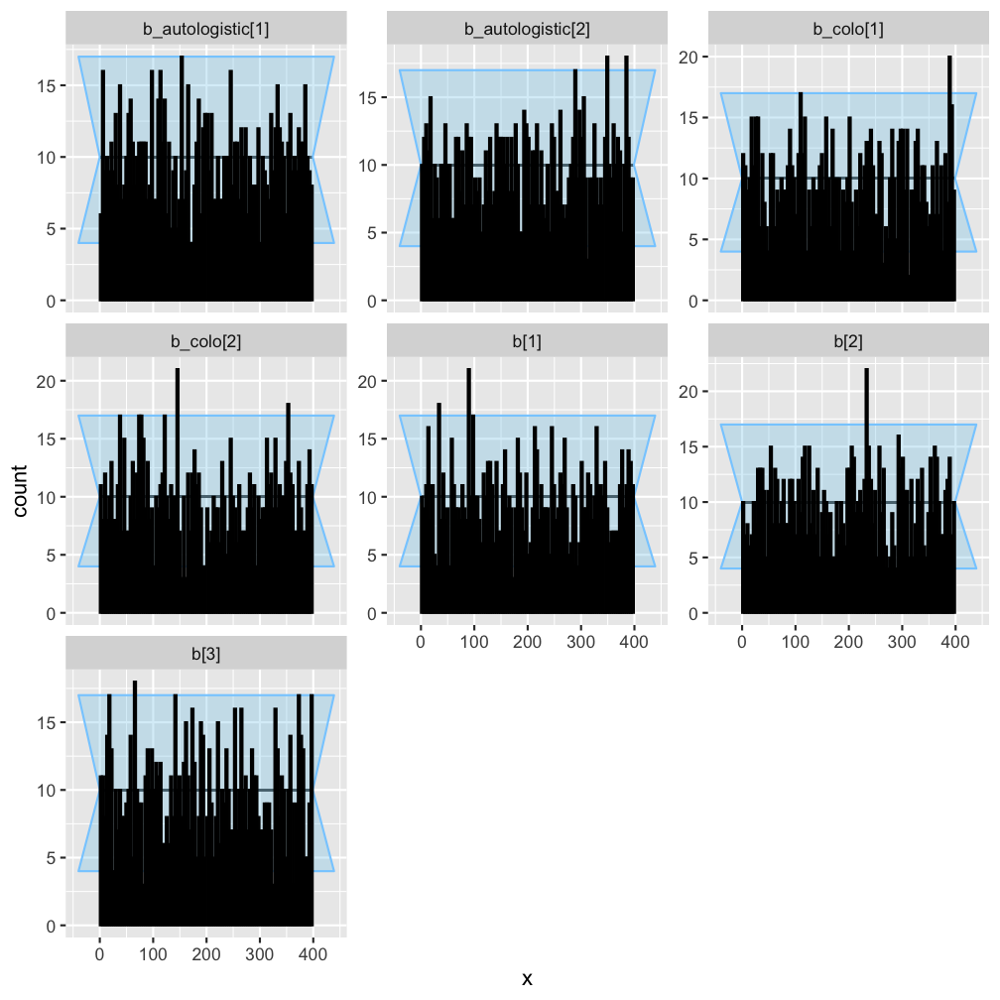
<p class="caption">plot of chunk multi-auto-eq</p>
</div>

``` r
plot_ecdf_diff(auto_eq_results)
```

<div class="figure">
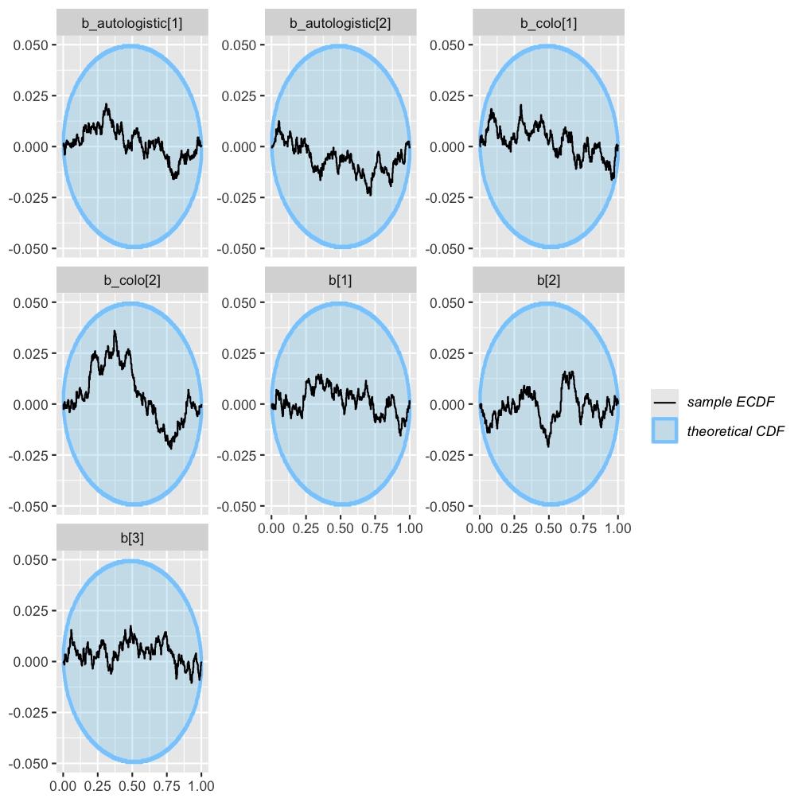
<p class="caption">plot of chunk multi-auto-eq</p>
</div>

