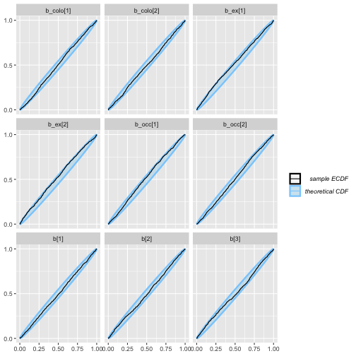
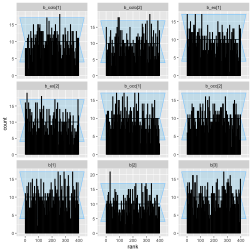
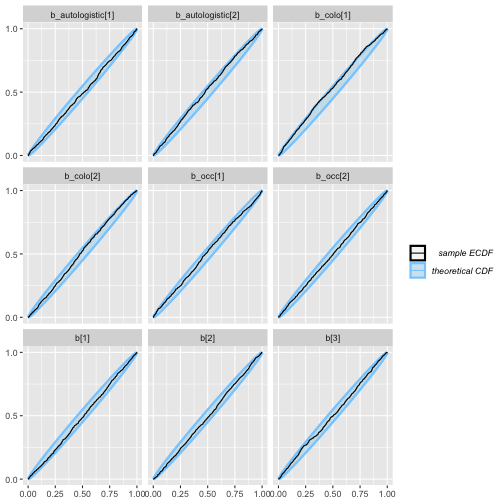
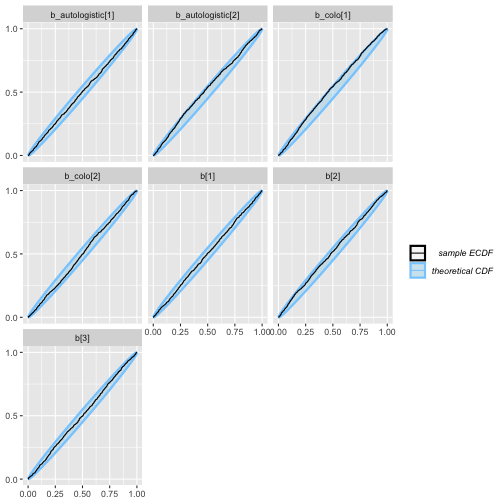
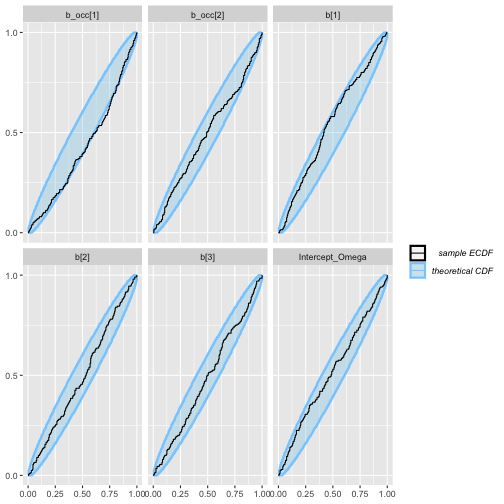
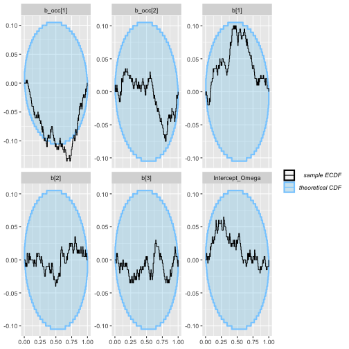

```r
params <- list(
  n_sims = 1000,
  n_sites = 200,
  n_sims_augmented = 200,
  n_sites_augmented = 50,
  n_pseudospecies_augmented = 50
)
```


```r
library(flocker)
library(brms)
library(SBC)
set.seed(1)
```

## Overview

This document performs simulation-based calibration for the models
available in R package `flocker`. Here, our goal is to validate `flocker`'s 
data formatting, decoding, and likelihood implementations, and not `brms`'s 
construction of the linear predictors.

The encoding of the data for a `flocker` model tends to be more complex in the 
presence of missing observations, and so we include missingness in the data 
simulation wherever possible (some visits missing in all models, some time-steps
missing in multiseason models). 

In all models, we include one unit covariate that affects detection and 
occupancy, colonization, extinction and/or autologistic terms as applicable, 
and one event covariate that affects detection only (for all models except the
rep-constant).

## Single-season

### Rep-constant

```r
# make the stancode
model_name <- paste0(tempdir(), "/sbc_rep_constant_model.stan")
fd <- simulate_flocker_data(
  n_pt = params$n_sites, n_sp = 1,
  params = list(
    coefs = data.frame(
      det_intercept = rnorm(1),
      det_slope_unit = rnorm(1),
      occ_intercept = rnorm(1),
      occ_slope_unit = rnorm(1)
    )
  ),
  seed = NULL,
  rep_constant = TRUE,
  ragged_rep = TRUE
)
flocker_data = make_flocker_data(fd$obs, fd$unit_covs, quiet = TRUE)
  
scode <- flocker_stancode(
    f_occ = ~ 0 + Intercept + uc1,
    f_det = ~ 0 + Intercept + uc1,
    flocker_data = flocker_data,
    prior = 
      brms::set_prior("std_normal()") + 
      brms::set_prior("std_normal()", dpar = "occ"),
    backend = "cmdstanr"
  )

writeLines(scode, model_name)

rep_constant_generator <- function(N){  
  fd <- simulate_flocker_data(
    n_pt = N, n_sp = 1,
    params = list(
      coefs = data.frame(
        det_intercept = rnorm(1),
        det_slope_unit = rnorm(1),
        occ_intercept = rnorm(1),
        occ_slope_unit = rnorm(1)
      )
    ),
    seed = NULL,
    rep_constant = TRUE,
    ragged_rep = TRUE
  )
  
  flocker_data = make_flocker_data(fd$obs, fd$unit_covs, quiet = TRUE)
  
  # format for return
  list(
    variables = list(
      `b[1]` = fd$params$coefs$det_intercept,
      `b[2]` = fd$params$coefs$det_slope_unit,
      `b_occ[1]` = fd$params$coefs$occ_intercept,
      `b_occ[2]` = fd$params$coefs$occ_slope_unit
    ),
    generated = flocker_standata(
      f_occ = ~ 0 + Intercept + uc1,
      f_det = ~ 0 + Intercept + uc1,
      flocker_data = flocker_data
    )
  )
}

rep_constant_gen <- SBC_generator_function(
  rep_constant_generator, 
  N = params$n_sites
  )
rep_constant_dataset <- suppressMessages(
  generate_datasets(rep_constant_gen, params$n_sims)
)
  
rep_constant_backend <- 
  SBC_backend_cmdstan_sample(
    cmdstanr::cmdstan_model(
      paste0(tempdir(), "/sbc_rep_constant_model.stan")
      )
    )

rep_constant_results <- compute_SBC(rep_constant_dataset, rep_constant_backend)

plot_ecdf(rep_constant_results)
```


```r
plot_rank_hist(rep_constant_results)
```


```r
plot_ecdf_diff(rep_constant_results)
```


### Rep-varying

```r
# make the stancode
model_name <- paste0(tempdir(), "/sbc_rep_varying_model.stan")
fd <- simulate_flocker_data(
  n_pt = params$n_sites, n_sp = 1,
  params = list(
    coefs = data.frame(
      det_intercept = rnorm(1),
      det_slope_unit = rnorm(1),
      det_slope_visit = rnorm(1),
      occ_intercept = rnorm(1),
      occ_slope_unit = rnorm(1)
    )
  ),
  seed = NULL,
  rep_constant = FALSE,
  ragged_rep = TRUE
)
flocker_data = make_flocker_data(fd$obs, fd$unit_covs, fd$event_covs, quiet = TRUE)
  
scode <- flocker_stancode(
    f_occ = ~ 0 + Intercept + uc1,
    f_det = ~ 0 + Intercept + uc1 + ec1,
    flocker_data = flocker_data,
    prior = 
      brms::set_prior("std_normal()") + 
      brms::set_prior("std_normal()", dpar = "occ"),
    backend = "cmdstanr"
  )
writeLines(scode, model_name)

rep_varying_generator <- function(N){  
  fd <- simulate_flocker_data(
    n_pt = N, n_sp = 1,
    params = list(
      coefs = data.frame(
        det_intercept = rnorm(1),
        det_slope_unit = rnorm(1),
        det_slope_visit = rnorm(1),
        occ_intercept = rnorm(1),
        occ_slope_unit = rnorm(1)
      )
    ),
    seed = NULL,
    rep_constant = FALSE,
    ragged_rep = TRUE
  )
  
  flocker_data = make_flocker_data(fd$obs, fd$unit_covs, fd$event_covs, quiet = TRUE)
  
  # format for return
  list(
    variables = list(
      `b[1]` = fd$params$coefs$det_intercept,
      `b[2]` = fd$params$coefs$det_slope_unit,
      `b[3]` = fd$params$coefs$det_slope_visit,
      `b_occ[1]` = fd$params$coefs$occ_intercept,
      `b_occ[2]` = fd$params$coefs$occ_slope_unit
    ),
    generated = flocker_standata(
      f_occ = ~ 0 + Intercept + uc1,
      f_det = ~ 0 + Intercept + uc1 + ec1,
      flocker_data = flocker_data
    )
  )
}

rep_varying_gen <- SBC_generator_function(
  rep_varying_generator, 
  N = params$n_sites
  )
rep_varying_dataset <- suppressMessages(
  generate_datasets(rep_varying_gen, params$n_sims)
)
  
rep_varying_backend <- 
  SBC_backend_cmdstan_sample(
    cmdstanr::cmdstan_model(
      paste0(tempdir(), "/sbc_rep_varying_model.stan")
      )
    )

rep_varying_results <- compute_SBC(rep_varying_dataset, rep_varying_backend)
```

```
##  - 3 (0%) fits had at least one Rhat > 1.01. Largest Rhat was 1.016.
```

```
## Not all diagnostics are OK.
## You can learn more by inspecting $default_diagnostics, $backend_diagnostics 
## and/or investigating $outputs/$messages/$warnings for detailed output from the backend.
```

```r
plot_ecdf(rep_varying_results)
```


```r
plot_rank_hist(rep_varying_results)
```


```r
plot_ecdf_diff(rep_varying_results)
```


## Multi-season
`flocker` fits multi-season models that parameterize the dynamics using colonization/extinction or autologistic specifications, and that parameterize
the initial occupancy state using explicit and equilibrium parameterizations, 
for a total of four classes of multi-season model. We validate each class.

### Colonization-extinction, explicit initial occupancy

```r
# make the stancode
model_name <- paste0(tempdir(), "/sbc_colex_ex_model.stan")
fd <- simulate_flocker_data(
  n_pt = params$n_sites, n_sp = 1, n_season = 4,
  params = list(
    coefs = data.frame(
      det_intercept = rnorm(1),
      det_slope_unit = rnorm(1),
      det_slope_visit = rnorm(1),
      occ_intercept = rnorm(1),
      occ_slope_unit = rnorm(1),
      col_intercept = rnorm(1),
      col_slope_unit = rnorm(1),
      ex_intercept = rnorm(1),
      ex_slope_unit = rnorm(1)
    )
  ),
  seed = NULL,
  rep_constant = FALSE,
  multiseason = "colex",
  multi_init = "explicit",
  ragged_rep = TRUE
)
flocker_data = make_flocker_data(
  fd$obs, fd$unit_covs, fd$event_covs,
  type = "multi", quiet = TRUE)
  
scode <- flocker_stancode(
    f_occ = ~ 0 + Intercept + uc1,
    f_col = ~ 0 + Intercept + uc1,
    f_ex = ~ 0 + Intercept + uc1,
    f_det = ~ 0 + Intercept + uc1 + ec1,
    flocker_data = flocker_data,
    prior = 
      brms::set_prior("std_normal()") + 
      brms::set_prior("std_normal()", dpar = "occ") +
      brms::set_prior("std_normal()", dpar = "colo") +
      brms::set_prior("std_normal()", dpar = "ex"),
    multiseason = "colex",
    multi_init = "explicit",
    backend = "cmdstanr"
  )
writeLines(scode, model_name)

colex_ex_generator <- function(N){  
  fd <- simulate_flocker_data(
    n_pt = params$n_sites, n_sp = 1, n_season = 4,
    params = list(
        det_intercept = rnorm(1),
        det_slope_unit = rnorm(1),
        det_slope_visit = rnorm(1),
        occ_intercept = rnorm(1),
        occ_slope_unit = rnorm(1),
        colo_intercept = rnorm(1),
        colo_slope_unit = rnorm(1),
        ex_intercept = rnorm(1),
        ex_slope_unit = rnorm(1)
    ),
    seed = NULL,
    rep_constant = FALSE,
    multiseason = "colex",
    multi_init = "explicit",
    ragged_rep = TRUE
  )
  
  flocker_data = make_flocker_data(
    fd$obs, fd$unit_covs, fd$event_covs,
    type = "multi", quiet = TRUE)
  
  # format for return
  list(
    variables = list(
      `b[1]` = fd$params$coefs$det_intercept,
      `b[2]` = fd$params$coefs$det_slope_unit,
      `b[3]` = fd$params$coefs$det_slope_visit,
      `b_occ[1]` = fd$params$coefs$occ_intercept,
      `b_occ[2]` = fd$params$coefs$occ_slope_unit,
      `b_colo[1]` = fd$params$coefs$col_intercept,
      `b_colo[2]` = fd$params$coefs$col_slope_unit,
      `b_ex[1]` = fd$params$coefs$ex_intercept,
      `b_ex[2]` = fd$params$coefs$ex_slope_unit
    ),
    generated = flocker_standata(
      f_occ = ~ 0 + Intercept + uc1,
      f_col = ~ 0 + Intercept + uc1,
      f_ex = ~ 0 + Intercept + uc1,
      f_det = ~ 0 + Intercept + uc1 + ec1,
      flocker_data = flocker_data,
      multiseason = "colex",
      multi_init = "explicit"
    )
  )
}

colex_ex_gen <- SBC_generator_function(
  colex_ex_generator, 
  N = params$n_sites
  )
colex_ex_dataset <- suppressMessages(
  generate_datasets(colex_ex_gen, params$n_sims)
)
  
colex_ex_backend <- 
  SBC_backend_cmdstan_sample(
    cmdstanr::cmdstan_model(
      paste0(tempdir(), "/sbc_colex_ex_model.stan")
      )
    )

colex_ex_results <- compute_SBC(colex_ex_dataset, colex_ex_backend)

plot_ecdf(colex_ex_results)
```



```r
plot_rank_hist(colex_ex_results)
```



```r
plot_ecdf_diff(colex_ex_results)
```


### Colonization-extinction, equilibrium initial occupancy

```r
# make the stancode
model_name <- paste0(tempdir(), "/sbc_colex_eq_model.stan")
fd <- simulate_flocker_data(
  n_pt = params$n_sites, n_sp = 1, n_season = 4,
  params = list(
      det_intercept = rnorm(1),
      det_slope_unit = rnorm(1),
      det_slope_visit = rnorm(1),
      colo_intercept = rnorm(1),
      colo_slope_unit = rnorm(1),
      ex_intercept = rnorm(1),
      ex_slope_unit = rnorm(1)
  ),
  seed = NULL,
  rep_constant = FALSE,
  multiseason = "colex",
  multi_init = "equilibrium",
  ragged_rep = TRUE
)
flocker_data = make_flocker_data(
  fd$obs, fd$unit_covs, fd$event_covs,
  type = "multi", quiet = TRUE)
  
scode <- flocker_stancode(
  f_col = ~ 0 + Intercept + uc1,
  f_ex = ~ 0 + Intercept + uc1,
  f_det = ~ 0 + Intercept + uc1 + ec1,
  flocker_data = flocker_data,
  prior = 
    brms::set_prior("std_normal()") + 
    brms::set_prior("std_normal()", dpar = "colo") +
    brms::set_prior("std_normal()", dpar = "ex"),
  multiseason = "colex",
  multi_init = "equilibrium",
  backend = "cmdstanr"
  )
writeLines(scode, model_name)

colex_eq_generator <- function(N){  
  fd <- simulate_flocker_data(
    n_pt = params$n_sites, n_sp = 1, n_season = 4,
    params = list(
        det_intercept = rnorm(1),
        det_slope_unit = rnorm(1),
        det_slope_visit = rnorm(1),
        col_intercept = rnorm(1),
        col_slope_unit = rnorm(1),
        ex_intercept = rnorm(1),
        ex_slope_unit = rnorm(1)
    ),
    seed = NULL,
    rep_constant = FALSE,
    multiseason = "colex",
    multi_init = "equilibrium",
    ragged_rep = TRUE
  )
  
  flocker_data = make_flocker_data(
    fd$obs, fd$unit_covs, fd$event_covs,
    type = "multi", quiet = TRUE)
  
  # format for return
  list(
    variables = list(
      `b[1]` = fd$params$coefs$det_intercept,
      `b[2]` = fd$params$coefs$det_slope_unit,
      `b[3]` = fd$params$coefs$det_slope_visit,
      `b_colo[1]` = fd$params$coefs$col_intercept,
      `b_colo[2]` = fd$params$coefs$col_slope_unit,
      `b_ex[1]` = fd$params$coefs$ex_intercept,
      `b_ex[2]` = fd$params$coefs$ex_slope_unit
    ),
    generated = flocker_standata(
      f_col = ~ 0 + Intercept + uc1,
      f_ex = ~ 0 + Intercept + uc1,
      f_det = ~ 0 + Intercept + uc1 + ec1,
      flocker_data = flocker_data,
      multiseason = "colex",
      multi_init = "equilibrium"
    )
  )
}

colex_eq_gen <- SBC_generator_function(
  colex_eq_generator, 
  N = params$n_sites
  )
colex_eq_dataset <- suppressMessages(
  generate_datasets(colex_eq_gen, params$n_sims)
)
  
colex_eq_backend <- 
  SBC_backend_cmdstan_sample(
    cmdstanr::cmdstan_model(
      paste0(tempdir(), "/sbc_colex_eq_model.stan")
      )
    )

colex_eq_results <- compute_SBC(colex_eq_dataset, colex_eq_backend)
```

```
##  - 1 (0%) fits had at least one Rhat > 1.01. Largest Rhat was 1.012.
```

```
##  - 853 (85%) fits had some steps rejected. Maximum number of rejections was 5.
```

```
## Not all diagnostics are OK.
## You can learn more by inspecting $default_diagnostics, $backend_diagnostics 
## and/or investigating $outputs/$messages/$warnings for detailed output from the backend.
```

```r
plot_ecdf(colex_eq_results)
```


```r
plot_rank_hist(colex_eq_results)
```


```r
plot_ecdf_diff(colex_eq_results)
```


### Autologistic, explicit initial occupancy

```r
# make the stancode
model_name <- paste0(tempdir(), "/sbc_auto_ex_model.stan")
fd <- simulate_flocker_data(
  n_pt = params$n_sites, n_sp = 1, n_season = 4,
  params = list(
      det_intercept = rnorm(1),
      det_slope_unit = rnorm(1),
      det_slope_visit = rnorm(1),
      occ_intercept = rnorm(1),
      occ_slope_unit = rnorm(1),
      col_intercept = rnorm(1),
      col_slope_unit = rnorm(1),
      auto_intercept = rnorm(1),
      auto_slope_unit = rnorm(1)
  ),
  seed = NULL,
  rep_constant = FALSE,
  multiseason = "autologistic",
  multi_init = "explicit",
  ragged_rep = TRUE
)
flocker_data = make_flocker_data(
  fd$obs, fd$unit_covs, fd$event_covs,
  type = "multi", quiet = TRUE)
  
scode <- flocker_stancode(
    f_occ = ~ 0 + Intercept + uc1,
    f_col = ~ 0 + Intercept + uc1,
    f_auto = ~ 0 + Intercept + uc1,
    f_det = ~ 0 + Intercept + uc1 + ec1,
    flocker_data = flocker_data,
    prior = 
      brms::set_prior("std_normal()") + 
      brms::set_prior("std_normal()", dpar = "occ") +
      brms::set_prior("std_normal()", dpar = "colo") +
      brms::set_prior("std_normal()", dpar = "autologistic"),
    multiseason = "autologistic",
    multi_init = "explicit",
    backend = "cmdstanr"
  )
writeLines(scode, model_name)

auto_ex_generator <- function(N){  
  fd <- simulate_flocker_data(
    n_pt = params$n_sites, n_sp = 1, n_season = 4,
    params = list(
        det_intercept = rnorm(1),
        det_slope_unit = rnorm(1),
        det_slope_visit = rnorm(1),
        occ_intercept = rnorm(1),
        occ_slope_unit = rnorm(1),
        colo_intercept = rnorm(1),
        colo_slope_unit = rnorm(1),
        auto_intercept = rnorm(1),
        auto_slope_unit = rnorm(1)
    ),
    seed = NULL,
    rep_constant = FALSE,
    multiseason = "autologistic",
    multi_init = "explicit",
    ragged_rep = TRUE
  )
  
  flocker_data = make_flocker_data(
    fd$obs, fd$unit_covs, fd$event_covs,
    type = "multi", quiet = TRUE)
  
  # format for return
  list(
    variables = list(
      `b[1]` = fd$params$coefs$det_intercept,
      `b[2]` = fd$params$coefs$det_slope_unit,
      `b[3]` = fd$params$coefs$det_slope_visit,
      `b_occ[1]` = fd$params$coefs$occ_intercept,
      `b_occ[2]` = fd$params$coefs$occ_slope_unit,
      `b_colo[1]` = fd$params$coefs$col_intercept,
      `b_colo[2]` = fd$params$coefs$col_slope_unit,
      `b_autologistic[1]` = fd$params$coefs$auto_intercept,
      `b_autologistic[2]` = fd$params$coefs$auto_slope_unit
    ),
    generated = flocker_standata(
      f_occ = ~ 0 + Intercept + uc1,
      f_col = ~ 0 + Intercept + uc1,
      f_auto = ~ 0 + Intercept + uc1,
      f_det = ~ 0 + Intercept + uc1 + ec1,
      flocker_data = flocker_data,
      multiseason = "autologistic",
      multi_init = "explicit"
    )
  )
}

auto_ex_gen <- SBC_generator_function(
  auto_ex_generator, 
  N = params$n_sites
  )
auto_ex_dataset <- suppressMessages(
  generate_datasets(auto_ex_gen, params$n_sims)
)
  
auto_ex_backend <- 
  SBC_backend_cmdstan_sample(
    cmdstanr::cmdstan_model(
      paste0(tempdir(), "/sbc_auto_ex_model.stan")
      )
    )

auto_ex_results <- compute_SBC(auto_ex_dataset, auto_ex_backend)

plot_ecdf(auto_ex_results)
```



```r
plot_rank_hist(auto_ex_results)
```


```r
plot_ecdf_diff(auto_ex_results)
```


### Autologistic, equilibrium initial occupancy

```r
# make the stancode
model_name <- paste0(tempdir(), "/sbc_auto_eq_model.stan")
fd <- simulate_flocker_data(
  n_pt = params$n_sites, n_sp = 1, n_season = 4,
  params = list(
      det_intercept = rnorm(1),
      det_slope_unit = rnorm(1),
      det_slope_visit = rnorm(1),
      auto_intercept = rnorm(1),
      auto_slope_unit = rnorm(1)
  ),
  seed = NULL,
  rep_constant = FALSE,
  multiseason = "autologistic",
  multi_init = "equilibrium",
  ragged_rep = TRUE
)
flocker_data = make_flocker_data(
  fd$obs, fd$unit_covs, fd$event_covs,
  type = "multi", quiet = TRUE)
  
scode <- flocker_stancode(
    f_col = ~ 0 + Intercept + uc1,
    f_auto = ~ 0 + Intercept + uc1,
    f_det = ~ 0 + Intercept + uc1 + ec1,
    flocker_data = flocker_data,
    prior = 
      brms::set_prior("std_normal()") + 
      brms::set_prior("std_normal()", dpar = "colo") +
      brms::set_prior("std_normal()", dpar = "autologistic"),
    multiseason = "autologistic",
    multi_init = "equilibrium",
    backend = "cmdstanr"
  )
writeLines(scode, model_name)

auto_eq_generator <- function(N){  
  fd <- simulate_flocker_data(
    n_pt = params$n_sites, n_sp = 1, n_season = 4,
    params = list(
        det_intercept = rnorm(1),
        det_slope_unit = rnorm(1),
        det_slope_visit = rnorm(1),
        col_intercept = rnorm(1),
        col_slope_unit = rnorm(1),
        auto_intercept = rnorm(1),
        auto_slope_unit = rnorm(1)
    ),
    seed = NULL,
    rep_constant = FALSE,
    multiseason = "autologistic",
    multi_init = "equilibrium",
    ragged_rep = TRUE
  )
  
  flocker_data = make_flocker_data(
    fd$obs, fd$unit_covs, fd$event_covs,
    type = "multi", quiet = TRUE)
  
  # format for return
  list(
    variables = list(
      `b[1]` = fd$params$coefs$det_intercept,
      `b[2]` = fd$params$coefs$det_slope_unit,
      `b[3]` = fd$params$coefs$det_slope_visit,
      `b_colo[1]` = fd$params$coefs$col_intercept,
      `b_colo[2]` = fd$params$coefs$col_slope_unit,
      `b_autologistic[1]` = fd$params$coefs$auto_intercept,
      `b_autologistic[2]` = fd$params$coefs$auto_slope_unit
    ),
    generated = flocker_standata(
      f_col = ~ 0 + Intercept + uc1,
      f_auto = ~ 0 + Intercept + uc1,
      f_det = ~ 0 + Intercept + uc1 + ec1,
      flocker_data = flocker_data,
      multiseason = "autologistic",
      multi_init = "equilibrium"
    )
  )
}

auto_eq_gen <- SBC_generator_function(
  auto_eq_generator, 
  N = params$n_sites
  )
auto_eq_dataset <- suppressMessages(
  generate_datasets(auto_eq_gen, params$n_sims)
)
  
auto_eq_backend <- 
  SBC_backend_cmdstan_sample(
    cmdstanr::cmdstan_model(
      paste0(tempdir(), "/sbc_auto_eq_model.stan")
      )
    )

auto_eq_results <- compute_SBC(auto_eq_dataset, auto_eq_backend)
```

```
##  - 302 (30%) fits had some steps rejected. Maximum number of rejections was 3.
```

```
## Not all diagnostics are OK.
## You can learn more by inspecting $default_diagnostics, $backend_diagnostics 
## and/or investigating $outputs/$messages/$warnings for detailed output from the backend.
```

```r
plot_ecdf(auto_eq_results)
```



```r
plot_rank_hist(auto_eq_results)
```


```r
plot_ecdf_diff(auto_eq_results)
```


## Data-augmented

```r
# make the stancode
model_name <- paste0(tempdir(), "/sbc_augmented_model.stan")

omega <- boot::inv.logit(rnorm(1, 0, .1))
available <- rbinom(1, params$n_pseudospecies_augmented, omega)
unavailable <- params$n_pseudospecies_augmented - available
coef_means <- rnorm(5) # normal prior on random effect means
sigma <- abs(rnorm(5)) # half-normal prior on all random effect sds
Sigma <- diag(5) * sigma

fd <- simulate_flocker_data(
  n_pt = params$n_sites_augmented, n_sp = available,
  params = list(
    coef_means = coef_means,
    Sigma = Sigma,
    coefs = data.frame(
      det_intercept = rnorm(available, coef_means[1], sigma[1]),
      det_slope_unit = rnorm(available, coef_means[2], sigma[2]),
      det_slope_visit = rnorm(available, coef_means[3], sigma[3]),
      occ_intercept = rnorm(available, coef_means[4], sigma[4]),
      occ_slope_unit = rnorm(available, coef_means[5], sigma[5])
    )
  ),
  seed = NULL,
  rep_constant = FALSE,
  ragged_rep = TRUE
)

obs_aug <- fd$obs[seq_len(params$n_sites_augmented), ]

for(i in 2:available){
  obs_aug <- abind::abind(
    obs_aug, 
    fd$obs[((i - 1) * params$n_sites_augmented) + seq_len(params$n_sites_augmented), ], 
    along = 3
    )
}

event_covs_aug <- list(ec1 = fd$event_covs$ec1[seq_len(params$n_sites_augmented), ])
unit_covs_aug <- data.frame(uc1 = fd$unit_covs[seq_len(params$n_sites_augmented), "uc1"])

flocker_data = make_flocker_data(
  obs_aug, unit_covs_aug, event_covs_aug,
  type = "augmented", n_aug = unavailable,
  quiet = TRUE)
  
scode <- flocker_stancode(
    f_occ = ~ 0 + Intercept + uc1 + (1 + uc1 || ff_species),
    f_det = ~ 0 + Intercept + uc1 + ec1 + (1 + uc1 + ec1 || ff_species),
    flocker_data = flocker_data,
    prior = 
      brms::set_prior("std_normal()") + 
      brms::set_prior("std_normal()", class = "sd") +
      brms::set_prior("std_normal()", dpar = "occ") +
      brms::set_prior("std_normal()", class = "sd", dpar = "occ") +
      brms::set_prior("normal(0, 0.1)", class = "Intercept", dpar = "Omega"),
    backend = "cmdstanr",
    augmented = TRUE
  )
writeLines(scode, model_name)

aug_generator <- function(N){  
  omega <- boot::inv.logit(rnorm(1, 0, .1))
  available <- rbinom(1, params$n_pseudospecies_augmented, omega)
  unavailable <- params$n_pseudospecies_augmented - available
  coef_means <- rnorm(5) # normal prior on random effect means
  sigma <- abs(rnorm(5)) # half-normal prior on all random effect sds
  Sigma <- diag(5) * sigma
  
  fd <- simulate_flocker_data(
    n_pt = params$n_sites_augmented, n_sp = available,
    params = list(
      coef_means = coef_means,
      Sigma = Sigma,
      coefs = data.frame(
        det_intercept = rnorm(available, coef_means[1], sigma[1]),
        det_slope_unit = rnorm(available, coef_means[2], sigma[2]),
        det_slope_visit = rnorm(available, coef_means[3], sigma[3]),
        occ_intercept = rnorm(available, coef_means[4], sigma[4]),
        occ_slope_unit = rnorm(available, coef_means[5], sigma[5])
      )
    ),
    seed = NULL,
    rep_constant = FALSE,
    ragged_rep = TRUE
  )
  
  obs_aug <- fd$obs[seq_len(params$n_sites_augmented), ]
  
  for(i in 2:available){
    obs_aug <- abind::abind(
      obs_aug, 
      fd$obs[((i - 1) * params$n_sites_augmented) + seq_len(params$n_sites_augmented), ], 
      along = 3
      )
  }
  
  event_covs_aug <- list(ec1 = fd$event_covs$ec1[seq_len(params$n_sites_augmented), ])
  unit_covs_aug <- data.frame(uc1 = fd$unit_covs[seq_len(params$n_sites_augmented), "uc1"])
  
  flocker_data = make_flocker_data(
    obs_aug, unit_covs_aug, event_covs_aug,
    type = "augmented", n_aug = unavailable,
    quiet = TRUE)
  # format for return
  list(
    variables = list(
      `b[1]` = fd$params$coef_means[1],
      `b[2]` = fd$params$coef_means[2],
      `b[3]` = fd$params$coef_means[3],
      `b_occ[1]` = fd$params$coef_means[4],
      `b_occ[2]` = fd$params$coef_means[5],
      `Intercept_Omega` = boot::logit(omega)
    ),
    generated = flocker_standata(
      f_occ = ~ 0 + Intercept + uc1 + (1 + uc1 || ff_species),
      f_det = ~ 0 + Intercept + uc1 + ec1 + (1 + uc1 + ec1 || ff_species),
      flocker_data = flocker_data,
      augmented = TRUE
    )
  )
}

aug_gen <- SBC_generator_function(
  aug_generator, 
  N = params$n_sites_augmented
  )
aug_dataset <- suppressMessages(
  generate_datasets(aug_gen, params$n_sims_augmented)
)
  
aug_backend <- 
  SBC_backend_cmdstan_sample(
    cmdstanr::cmdstan_model(
      paste0(tempdir(), "/sbc_augmented_model.stan")
      )
    )

aug_results <- compute_SBC(aug_dataset, aug_backend)
```

```
##  - 4 (2%) fits had at least one Rhat > 1.01. Largest Rhat was 1.022.
```

```
##  - 2 (1%) fits had divergent transitions. Maximum number of divergences was 2.
```

```
##  - 7 (4%) fits had some steps rejected. Maximum number of rejections was 1.
```

```
## Not all diagnostics are OK.
## You can learn more by inspecting $default_diagnostics, $backend_diagnostics 
## and/or investigating $outputs/$messages/$warnings for detailed output from the backend.
```

```r
plot_ecdf(aug_results)
```



```r
plot_rank_hist(aug_results)
```


```r
plot_ecdf_diff(aug_results)
```


